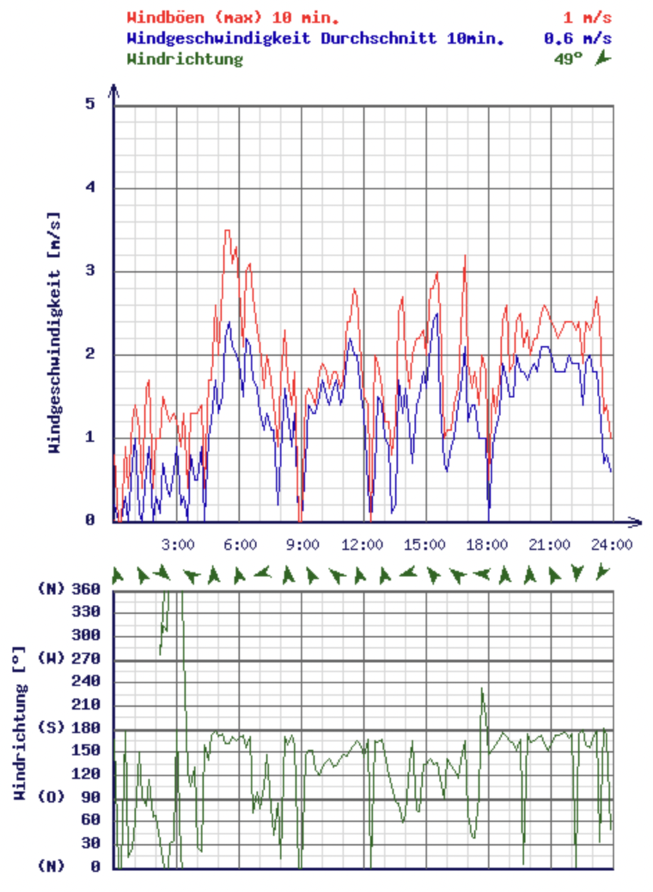
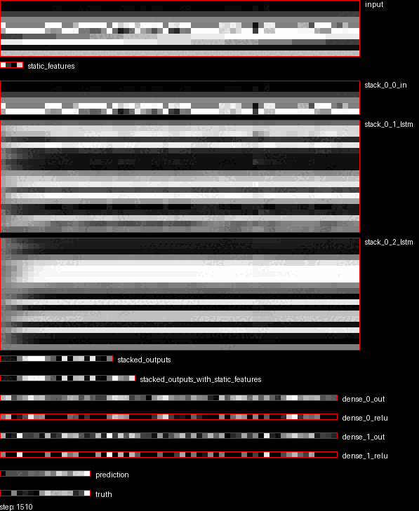
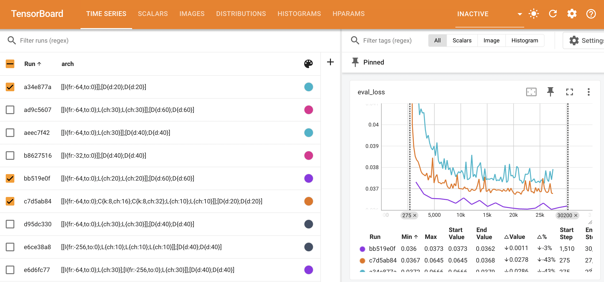
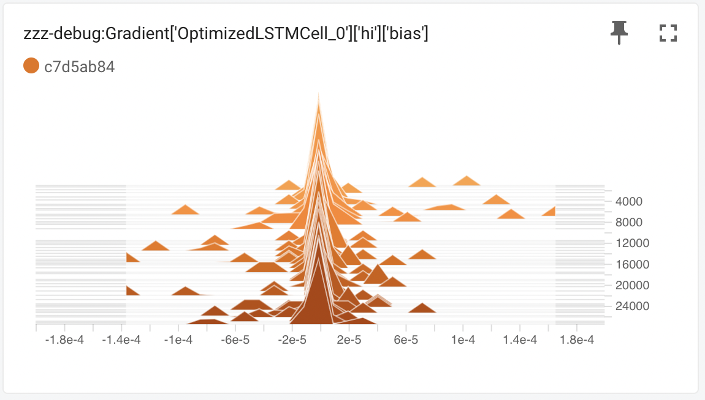
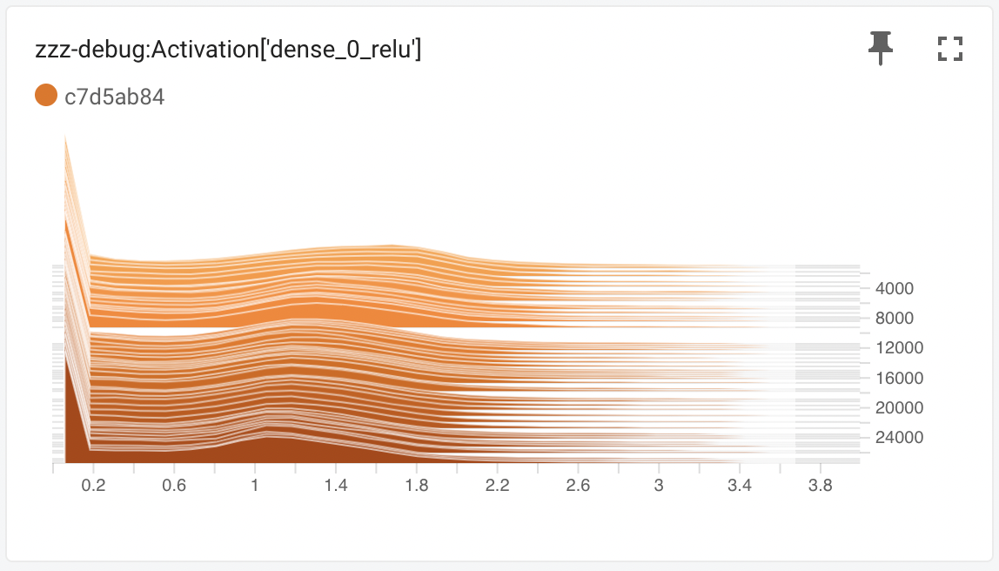
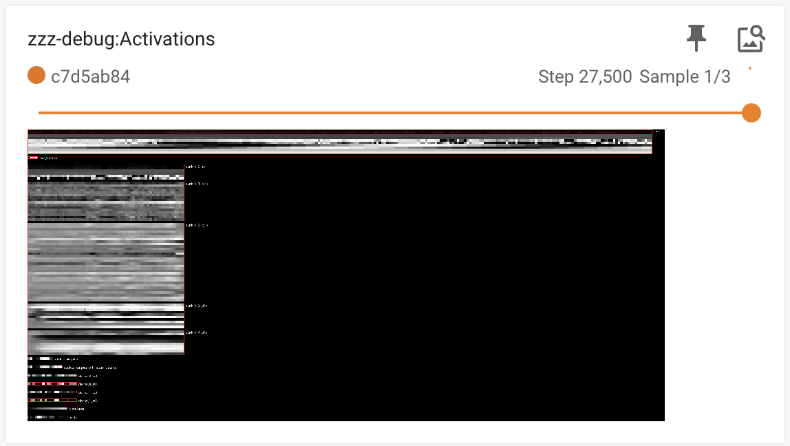
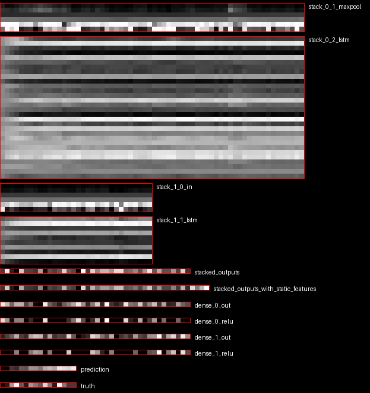

# Wind Prediction for Lake Zurich in JAX (from Scratch)

Wind/Gust Speed and Direction | LSTM and Dense Activations during Training
---|---
 | 


# Table of Contents

Section|Description
---|---
[Overview](#overview) | A brief overview of the project, its objectives, and what it achieves
[Data Preparation](#data-preparation) | Detail the data collection, cleaning, and preprocessing steps
[Model Architectures](#model-architectures) | [Baseline Models](#baselines), [Neural Network Models](#neural-architectures), Regularization Techniques, [Debugging](#debugging)
[Training Process](#training) | Dropout, Early Stopping
[Results](#results) | Summary of results
[Analysis and Discussion](#analysis-and-discussion) | [Effect of features](#effect-of-features), [Effect of look-back window](#effect-of-look-back-window), [Effect of available training data](#effect-of-available-training-data)
[Conclusion](#discussion) | Conclusion

# Overview

In this project, I train a neural network to predict the wind on lake Zurich
based on data from 2 weather stations (Mythenquai, Tiefenbrunnen). The data is
sampled at 10-minute intervals and has features such as `wind speed`, `wind
direction`, `air temperature`, `air pressure`, etc (10 in total).

The task is to predict the next `P` timesteps of `wind speed` given the past
`H` timesteps (any of the features above). I separate train/test sets by years
(i.e.  train on 2019-2022 and evaluate on 2023). I use the root-mean-square
error (RMSE) between the predictions and the ground truth to evaluate the
model. I aimed at predicting 16 timesteps (so 2h and 40mins into the future,
which is enough for a short sailing trip on the lake).

I scrape and preprocess the data (feature normalization, data cleanup), and the
impact of the features, model architectures and training schemes on them.

To evaluate different classes of model architectures, I implemented a small
descriptor to represent such architectures efficiently. An example of such a
descriptor is
`[[I{fr:-256,to:0};M{w:4};L{ch:30}];[I{fr:-32,to:0};L{ch:10}]];[D{d:40};D{d:40}]`.
See [Neural Architectures](#neural-architectures) for more details.

All training runs are exported to Tensorboard:



I also export gradients, activations, and a visualization of the model
architecture directly to Tensorboard for debugging purposes.

Gradients | Activations | Model Architecture
---|---|---
||

Note that I always do some special handling of "static" features (date/time),
see `stacked_outputs_with_static_features`.

Besides for the pure fun of looking at it, I used the above visualizations
mostly to make sure the code is implemented correctly - and to check for things
like exploding or vanishing gradients.

# Data Preparation

Please see the scripts to download and prepare the wind data in `./data/`. The
scripts are missing the URL of the source on purpose, as the weather stations
don't officially permit scraping the data.

## Scraping and conversion to Numpy

1. Download the HTMLs. Example: Download data from January 2017

```
bash download-htmls.sh mythenquai 2017 01
bash download-htmls.sh tiefenbrunnen 2017 01
```

2. Parse HTMLs and create numpy timeseries

```
python3 parse-and-write-timeseries.py \
  --location=mythenquai \
  --output_file=mythenquai.raw.npy
```

## Filter days with broken data

`check-data.py` runs over data for each day and throws out days for which there
is at least 1 entry NOT fullfilling the following conditions:

Field        | What       |   Min | Max
-------------|------------|------:|------:
DAY          | Value      |   1.0 |   31.0
HOUR         | Value      |   0.0 |   24.0
AIR_TEMP     | Value      | -15.0 |   50.0
WATER_TEMP   | Value      |   0.0 |   50.0
HUMIDITY     | Value      |   0.0 |  105.0
WIND_SPEED   | % non-zero |  20.0 |  100.0
WIND_SPEED   | Value      |   0.0 |   35.0
GUST_SPEED   | Value      |   0.0 |   35.0
WIND_DIR     | % non-zero |  20.0 |  100.0
WIND_DIR     | Value      |   0.0 |  360.0
AIR_PRESSURE | Value      | 800.0 | 1200.0

This is needed because there are some days when a given sensor seems to report
broken data (or no data at all).

```
python3 check-data.py \
  --file=mythenquai.raw.npy \
  --output_file=./mythenquai.clean.npy
```

## Feature scaling

In particular, all features are scaled to have a range of [0,1]. For this, the
following input ranges are scaled to [0,1]:

Feature      |  Unit |  From | To
-------------|------:|------:|-----:
WIND_SPEED   | m/s   |  0.0   | 25.0
GUST_SPEED   | m/s   | 0.0   | 25.0
AIR_PRESSURE | hPa   | 950.0 | 1050.0
AIR_TEMP     | deg C | -15.0 | 40.0
WATER_TEMP   | def C |0.0   | 30.0
SIN_HOUR     | n/a   | -1.0  | 1.0
COS_HOUR     | n/a   | -1.0  | 1.0
SIN_MONTH    | n/a   | -1.0  | 1.0
COS_MONTH    | n/a   | -1.0  | 1.0
SIN_WIND_DIR | n/a   | -1.0  | 1.0
COS_WIND_DIR | n/a   | -1.0  | 1.0

This is done in the `preprocess.py` script.

Yes, I did use static min and max values. I guess I could also have used
something like a `MinMax` scaler to do it automatically.

Also, note that I created Sine and Cosine features for "periodic" values such
as hour of the day, month and wind direction. From my experiments, it doesn't
make a huge difference - but I do think it makes a lot of sense to use these
instead of the raw values (otherwise you will have "jumps" in the input
features).

## Train and test splits

The `generate-examples.py` tool generates the final train and test data. It
takes the following parameters:
* Features: A comma-separated list of features to include as input `X`
* History: Length of history for each example in `X`
* Predictions: Number of predictions to include in `Y`

With `H` timesteps of history, and `P` timesteps of predictions, and `F` input
features, the generated data are numpy `npz` files having the following arrays:

Array | Shape     | Description
------|-----------|-----------------------------------
`X`   | `[N,H,F]` | `N` is the number of train examples
`Y`   | `[N,P]`   | 
`XT`  | `[M,H,F]` | `M` is the number of test examples
`YT`  | `[M,P]`   |

Only examples that have no "gap" in the input training data are used as
examples: if there is 1 missing value in the middle of the day, no examples
that have some overlap with with that point in time will be output.

Note that the generate data is quite redundant, as can be seen in this example
(with `F=1`, `H=4`, `P=2`). Unnecessary nesting is removed:

`X` | `Y`
---|---
[1, 2, 3, 4] | [5, 6]
[2, 3, 4, 5] | [6, 7]
[3, 4, 5, 6] | [7, 8]
...|...

I could also do these kinds of computations on the fly - but I preferred to
have it persisted this way, so I could inspect and debug the data more easily.

**Example:** Generate data with `history=16`, `future=16`:

```
python3 generate-examples.py \
  --features=wind_speed,gust_speed,air_pressure,air_temp,sin_wind_dir,cos_wind_dir,sin_hour,cos_hour \
  --files=tiefenbrunnen.clean.npy,mythenquai.clean.npy \
  --output_file=both.clean.small.8feature.16h.examples \
  --history=16 \
  --future=16
```

**Example:** Generate data with `history=32`, `future=16`:

```
python3 generate-examples.py \
  --features=wind_speed,gust_speed,air_pressure,air_temp,sin_wind_dir,cos_wind_dir,sin_hour,cos_hour \
  --files=tiefenbrunnen.clean.npy,mythenquai.clean.npy \
  --output_file=both.clean.small.8feature.32h.examples \
  --history=32 \
  --future=16
```


# Model Architectures

## Baselines

I implement some very basic baselines and evaluate them:

* `last_value` takes the last value of the wind speed for all predictions
* `const_value_x` takes `x` for all predictions
* `mean_value` takes the mean of the last `H` timesteps for all predictions

The results can be seen in the [Results](#results) section.

## Neural Architectures

As mentioned in the intro, I implement a mini language to describe the model
architectures.

Descriptor | Explanation
:--|:--
`I{fr:-256,to:0}` | Input features from 256 time steps ago to 0
`M{w:2}` | Max pool the output of the previous stage (w: window size)
`L{ch:20}` | Apply LSTM to the output of the previous stage (ch: dim hidden state)
`C{ch:20, k: 16}` | Apply a CNN across the time axis to the output of the previous stage (ch: number of channels, k: size of the kernel \[time steps\])
`D{dim:20}` | Apply a dense layer to the output of the previous stage 

The above language allows things like:
* `[I{fr:-256,to:0};M{w:2}...]` which takes a history of 256 and maxpools it to 128
* `[C{ch:10, k:16};L{ch:20}]` which combines convolutions with an LSTM
* `[...;L{ch:20};L{ch:20}]` which stacks multiple LSTMs
* `[...;C{...};C{...}]` which stacks multiple CNNs
* `...;[D{dim:20};D{dim:20}]` which defines the final dense layer

I ran experiments with various combinations of input features, max pooling,
LSTM layers and CNNs.

## Debugging

For debugging purposes, I implemented a visualization of the neural
architecture. For each part of the resulting Here is a closer look at the
visualization of the model during inference for
`[[I{fr:-256,to:0};M{w:4};L{ch:30}];[I{fr:-32,to:0};L{ch:10}]];[D{dim:40};D{dim:40}]`.



In the picture, `stack_0_1_maxpool` corresponds to the output of
`I{fr:-256,to:0};M{w:4}`. `stack_0_2_lstm` corresponds to the output of
`L{ch:30}`. `stack_1_0_in` corresponds to `I{fr:-32,to:0}`, and
`stack_1_1_lstm` is the output of `L{ch:10}`. `stacked_outputs` is the
concatenation of final LSTM states. `stacked_outputs_with_static_features` also
concatenates additional static features (sin and cos of hour and month). The
entries `dense_*_*` represent the final dense layer. `prediction` corresponds
to the final output and `truth` corresponds to the ground truth for this
example.

Note that for each array, the colors are scaled such that the minimum value
corresponds to black and the maximum value corresponds to white. This means
that for example for `predict` and `truth` the colors could be the same, but
still there is a discrepancy in actual values.

# Training

* Dropout: I applied dropout to all layers. I also tried only applying it to
  LSTM layers. However, any use of dropout made the results worse.

* Batchnorm: I can clearly see the effect of batch norm: The training run
  converges much faster. However, the final results were worse with batch norm
  enabled. I think this is because the task is a regression problem and batch
  norm effectively removes information from the input through the normalization
  - which might be important information for the regression itself.

WHERE DO I PUT THE BATCH NORM LAYERS. I put them between the final dense
layers, and in the CNN layers. In-between the LSTM layers, I don't put them. WHY??

# Results

## Baselines

Here are the results for `both.clean.small.8feature.16h.examples.npz`:

History | Algorithm        | RMSE
--------|------------------|-------
n/a     |       last_value | 0.0436
16      |       mean_value | 0.0436
32      |       mean_value | 0.0450
n/a     | const_value_0.07 | 0.0575
n/a     | const_value_0.00 | 0.0876

So just repeating the last wind speed for the next 16 timesteps is the best
(out of these simple baselines). Using the mean value over the last 16 or 32
timesteps is worse. Always predicting 0.07 (which translates to 1.75m/s) is a
bit worse. Always predicting zero is the worst.

## Neural Architectures

Here are the best results obtained by evaluating various model architectures as
listed in `./eval-arch.sh`.

Run     | RMSE | Architecture | Dropout
--------|------|--------------|--------
0dcb67eb|0.0359|[[I{fr:-64,to:0};L{ch:30}]];[D{d:40};D{d:40}]|false
6865e834|0.0359|[[I{fr:-256,to:0};L{ch:30}]];[D{d:40};D{d:40}]|false
79e0c7af|0.0359|[[I{fr:-256,to:0};M{w:4};L{ch:30}];[I{fr:-64,to:0};L{ch:30}]];[D{d:40};D{d:40}]|false
0c6238c2|0.036|[[I{fr:-64,to:0};L{ch:30}];[I{fr:-256,to:0};L{ch:30}]];[D{d:40};D{d:40}]|false
0d0dacea|0.036|[[I{fr:-256,to:0};L{ch:30};L{ch:30}]];[D{d:40};D{d:40}]|false
315ad7b4|0.036|[[I{fr:-256,to:0};L{ch:10};L{ch:10};L{ch:10}]];[D{d:40};D{d:40}]|false
440867bf|0.036|[[I{fr:-64,to:0};L{ch:30};L{ch:30}]];[D{d:40};D{d:40}]|false
571fb5cf|0.036|[[I{fr:-64,to:0};L{ch:30}];[I{fr:-256,to:0};L{ch:30}]];[D{d:40};D{d:40}]|true
9b937108|0.036|[[I{fr:-256,to:0};M{w:2};L{ch:30}];[I{fr:-64,to:0};L{ch:30}]];[D{d:40};D{d:40}]|false
1a7b3ddb|0.0361|[[I{fr:-256,to:0};M{w:2};L{ch:30}];[I{fr:-64,to:0};L{ch:30}]];[D{d:40};D{d:40}]|true
4c31919c|0.0361|[[I{fr:-32,to:0}]];[D{d:40};D{d:40}]|false
528573cf|0.0361|[[I{fr:-256,to:0};M{w:4};L{ch:30}];[I{fr:-64,to:0};L{ch:30}]];[D{d:40};D{d:40}]|true
9a5839bb|0.0361|[[I{fr:-64,to:0};L{ch:30}]];[D{d:40};D{d:40}]|true
bd4af8e2|0.0361|[[I{fr:-32,to:0}]];[D{d:40};D{d:40}]|true
fec09d3c|0.0361|[[I{fr:-64,to:0};C{k:8,ch:16};C{k:8,ch:32};L{ch:10};L{ch:10}]];[D{d:20};D{d:20}]|false
0de00f49|0.0362|[[I{fr:-256,to:0};L{ch:30};L{ch:30};L{ch:30}]];[D{d:40};D{d:40}]|false
31fda887|0.0362|[[I{fr:-64,to:0}]];[D{d:40};D{d:40}]|false
34f243cf|0.0362|[[I{fr:-64,to:0}]];[D{d:40};D{d:40}]|true
4c97c7e0|0.0362|[[I{fr:-256,to:0};L{ch:30}]];[D{d:40};D{d:40}]|true
4fef08f6|0.0362|[[I{fr:-32,to:0}]];[D{d:20};D{d:20}]|true
5b5eeb49|0.0362|[[I{fr:-64,to:0};C{k:8,ch:16};C{k:8,ch:32};L{ch:10};L{ch:10}]];[D{d:20};D{d:20}]|true
64090e5a|0.0363|[[I{fr:-256,to:0};L{ch:30};L{ch:30}]];[D{d:40};D{d:40}]|true
7bbde554|0.0363|[[I{fr:-32,to:0}]];[D{d:20};D{d:20}]|false
c02aa14d|0.0363|[[I{fr:-64,to:0};L{ch:30};L{ch:30}]];[D{d:40};D{d:40}]|true
007f1e65|0.0364|[[I{fr:-256,to:0};L{ch:10};L{ch:10};L{ch:10}]];[D{d:40};D{d:40}]|true
07a7ece9|0.0364|[[I{fr:-256,to:0};L{ch:30};L{ch:30};L{ch:30}]];[D{d:40};D{d:40}]|true
23e53098|0.0364|[[I{fr:-64,to:0}]];[D{d:20};D{d:20}]|true
dd4b7fb7|0.0364|[[I{fr:-64,to:0}]];[D{d:20};D{d:20}]|false
133343f1|0.0365|[[I{fr:-64,to:0};C{k:8,ch:16};C{k:8,ch:32}]];[D{d:20};D{d:20}]|false
7d8736dd|0.0365|[[I{fr:-64,to:0};C{k:8,ch:16};C{k:8,ch:32}]];[D{d:20};D{d:20}]|true

# Analysis and Discussion

## Effect of features

Using the model structure `[[I{fr:-64,to:0};L{ch:30}]];[D{d:40};D{d:40}]`, the
following table shows how the different features affect the final performance
of the model.

Input Features   | RSME
-----------------|--------
`WIND_SPEED`     | 0.0382
+`GUST_SPEED`   | 0.0374
+`AIR_PRESSURE` | 0.0370
+`AIR_TEMP`     | 0.0362
+`WIND_DIR`     | 0.0362
+`HOUR`         | 0.0360
+`MONTH`        | 0.0360
`HOUR` `MONTH` as static features | 0.0359

The last entry shows the results in which the `HOUR` and `MONTH` features are
not fed as time dependent features, but directly as static features into the
dense layers.

## Effect of look-back window

`[I{fr:-H,to:0};L{ch:30}]];[D{d:40};D{d:40}]`

History | RSME
--------|-----
1       | 0.0372
2       | 0.0367
4       | 0.0364
8       | 0.0362
16      | 0.0360
32      | 0.0359
64      | 0.0359
128     | 0.0358
256     | 0.0358

Beyond a history of 128 (~20h), there are diminishing returns in the predictive
power.

## Effect of available training data

Using the model structure `[[I{fr:-64,to:0};L{ch:30}]];[D{d:40};D{d:40}]`, the
following table shows how the amount of available training data affects the
resulting performance of the model on a holdout set.

Data Used   | RMSE
------------|---------------
100%        | 0.0359
50%         | 0.0359
25%         | 0.0363
10%         | 0.0367
5%          | 0.0373
3%          | 0.0379
1%          | 0.0516

It can be seen that the performance reaches a plateau: using only half of the
training data does not cause any decrease in performace. Based on this, it
looks like collecting more data won't help much and the model might already
exploit all available redundancies in the data for its predictions.


# Conclusion

* Dense is actually quite ok.
* CNNs don't work very well.
* LSTM is best.
* I could not find any improvements by combining CNNs with LSTMs.
