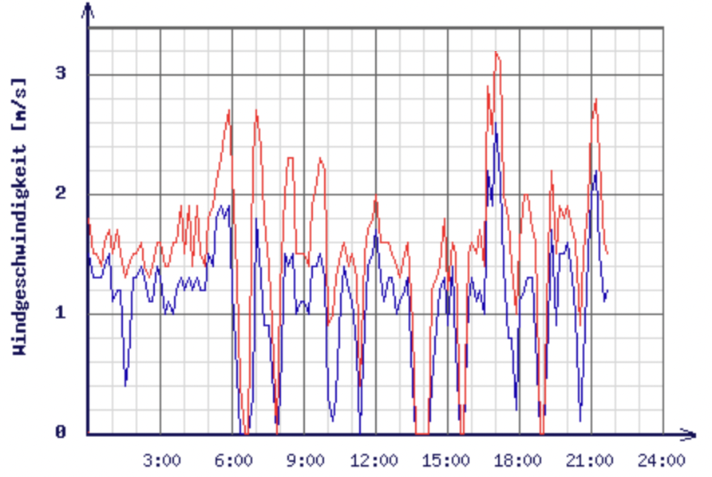
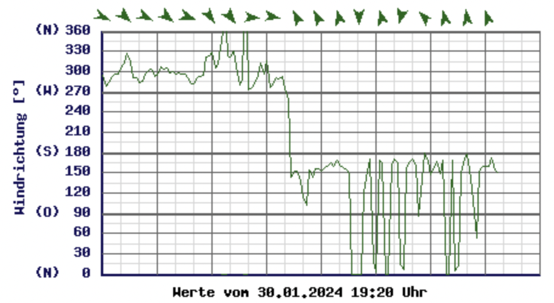

# Wind Prediction for Lake Zurich (CNNs, LSTMs) in JAX

Keywords: Dataset preparataion. Jax, Tensorboard, Visualization, CNNs,
Debugging, Max-Pooling, Batchnorm (not), Regression.  Evaluation of the
features. Comparison of Model architectures.

Wind/Gust Speed|Wind Direction
---|---
 | 

# Overview
* [Intro](#intro)
* [Task Definition](#task-definition)
* [Preparing Wind Data](#preparing-wind-data)
* [Model Architectures](#model-architectures)
  * Dense NN
  * CNNs
* Loss functions
  * MSE
  * Weighted MSE
  * Huber-Loss
* Debugging
  * Comparing with Baselines
  * Tensorboard
  * Drawing Activations
* Results

# Intro

In this project, I scrape wind data for 2 weather stations at lake Zurich. I
preprocess the data (feature extraction, data cleanup), and evaluate different
features and model architectures on the data.

I implemented a small descriptor to explore different architectures:

Descriptor | Explanation
:--|:--
`I{fr:-256,to:0}` | Input features from 256 time steps ago to 0
`M{w:2}` | Max pool the output of the previous stage (w: window size)
`L{ch:20}` | Apply LSTM to the output of the previous stage (ch: dim hidden state)
`C{ch:20, k: 16}` | Apply a CNN across the time axis to the output of the previous stage (ch: number of channels, k: size of the kernel \[time steps\])
`D{dim:20}` | Apply a dense layer to the output of the previous stage 

**Example:**

```
[[I{fr:-256,to:0};M{w:4};L{ch:30}];[I{fr:-32,to:0};L{ch:10}]];[D{d:40};D{d:40}]
```

* Take the last 256 time steps, max pool with width 4, and apply 1 LSTM layer (dim: 30) to it.
* Take the last 32 time steps, and apply 1 LSTM layer (dim: 10) to it.
* Concatenate the outputs of the final state
* Run it through 2 layers of a dense network

I also implement model debugging to visualize the model architecture and
activations during inference. This is what overall model looks like (color
indicate the activations for a given example, I cut out the 256 steps long
original input for brevity):


# Task Definition

The goal is to read the past N timesteps (any observations we have) and predict
the next M timesteps for wind speed.

We will use data from different years for training and evaluation.

We use the root-mean-square error (RMSE) between the predictions and the ground
truth to evaluate the model.

# Preparing Wind Data

## Download the HTMLs you want

```
bash download-htmls.sh mythenquai 2017 01
bash download-htmls.sh tiefenbrunnen 2017 01
```

## Parse HTMLs and create numpy timeseries

```
python3 parse-and-write-timeseries.py \
  --location=mythenquai \
  --output_file=mythenquai.raw.npy
```

## Filter days with broken data

`check-data.py` runs over data for each day and throws out days for which there
is at least 1 entry NOT fullfilling the folowing conditions:

Field        | What       |   Min | Max
-------------|------------|------:|------:
DAY          | Value      |   1.0 |   31.0
HOUR         | Value      |   0.0 |   24.0
AIR_TEMP     | Value      | -15.0 |   50.0
WATER_TEMP   | Value      |   0.0 |   50.0
HUMIDITY     | Value      |   0.0 |  105.0
WIND_SPEED   | % non-zero |  20.0 |  100.0
WIND_SPEED   | Value      |   0.0 |   35.0
GUST_SPEED   | Value      |   0.0 |   35.0
WIND_DIR     | % non-zero |  20.0 |  100.0
WIND_DIR     | Value      |   0.0 |  360.0
AIR_PRESSURE | Value      | 800.0 | 1200.0

```
python3 check-data.py \
  --file=mythenquai.raw.npy \
  --output_file=./mythenquai.clean.npy
```

## Preprocessing

Data is preprocessed using `preprocess.py`. In particular, all features are
scaled to have a range of [0,1]. For this, the following input ranges are
scaled to [0,1]:

Feature      |  Unit |  From | To
-------------|------:|------:|-----:
WIND_SPEED   | m/s   |  0.0   | 25.0
GUST_SPEED   | m/s   | 0.0   | 25.0
AIR_PRESSURE | hPa   | 950.0 | 1050.0
AIR_TEMP     | deg C | -15.0 | 40.0
WATER_TEMP   | def C |0.0   | 30.0
SIN_HOUR     | n/a   | -1.0  | 1.0
COS_HOUR     | n/a   | -1.0  | 1.0
SIN_MONTH    | n/a   | -1.0  | 1.0
COS_MONTH    | n/a   | -1.0  | 1.0
SIN_WIND_DIR | n/a   | -1.0  | 1.0
COS_WIND_DIR | n/a   | -1.0  | 1.0

## Generate final train and test data

The following tool generates the final train and test data. It takes the
following parameters:

Parameter   | Description
------------|-----------------------------------------------------------
Features    | A comma-separated list of features to include as input `X`
History     | Length of history for each example in `X`
Predictions | Number of predictions to include in `Y`

The generated data are numpy `npz` files having the following arrays:

Array | Shape                | Description
------|----------------------|-----------------------------------
X     | [N,History,Features] | N is the number of train examples
Y     | [N,Predictions]      |
XT    | [M,History,Features] | M is the number of test examples
YT    | [M,Predictions]      |

Only examples that have no gap in the input training data are used as examples.

Note that the generate data is quite redundant, as can be seen in this example
(with Features=1, History=4, Future=2). Unnecessary nesting is removed:

X | Y
--|---
[1, 2, 3, 4] | [5, 6]
[2, 3, 4, 5] | [6, 7]
[3, 4, 5, 6] | [7, 8]
...|...

## Generate data with `history=16`, `future=16`:

We call this one `both.clean.small.8feature.16h.examples.npz`:

```
python3 generate-examples.py \
  --features=wind_speed,gust_speed,air_pressure,air_temp,sin_wind_dir,cos_wind_dir,sin_hour,cos_hour \
  --files=tiefenbrunnen.clean.npy,mythenquai.clean.npy \
  --output_file=both.clean.small.8feature.16h.examples \
  --history=16 \
  --future=16
```

## Generate data with `history=32`, `future=16`:

We call this one `both.clean.small.8feature.32h.examples.npz`:

```
python3 generate-examples.py \
  --features=wind_speed,gust_speed,air_pressure,air_temp,sin_wind_dir,cos_wind_dir,sin_hour,cos_hour \
  --files=tiefenbrunnen.clean.npy,mythenquai.clean.npy \
  --output_file=both.clean.small.8feature.32h.examples \
  --history=32 \
  --future=16
```


# Models Architecture
## Baselines

To start, I implement some very basic baselines and evaluate them:
* `last_value` takes the last value of the wind speed for all predictions
* `const_value_x` takes `x` for all predictions
* `mean_value` takes the mean of the last `h` timesteps for all predictions

Here are the results for `both.clean.small.8feature.16h.examples.npz`:

History | Algorithm        | RMSE
--------|------------------|-----------
n/a     |       last_value | 0.04641434
n/a     | const_value_0.00 | 0.09431773
n/a     | const_value_0.07 | 0.06256304
16      |       mean_value | 0.04707646
32      |       mean_value | 0.04519560

## Exploring Model Architectures

As mentioned in the intro, I implement a mini language to describe the model
architectures.

Descriptor | Explanation
:--|:--
`I{fr:-256,to:0}` | Input features from 256 time steps ago to 0
`M{w:2}` | Max pool the output of the previous stage (w: window size)
`L{ch:20}` | Apply LSTM to the output of the previous stage (ch: dim hidden state)
`C{ch:20, k: 16}` | Apply a CNN across the time axis to the output of the previous stage (ch: number of channels, k: size of the kernel \[time steps\])
`D{dim:20}` | Apply a dense layer to the output of the previous stage 

I ran experiments with various combinations of input features, max pooling,
LSTM layers and CNNs.

## Exploring Training Techniques

### Dropout

I applied dropout to all layers. I also tried only applying it to LSTM layers.
However, any use of dropout made the results worse.

### Batchnorm

I can clearly see the effect of batch norm: The training run converges much
faster. However, the final results were worse with batch norm enabled. I think
this is because the task is a regression problem and batch norm effectively
removes information from the input through the normalization - which might be
important information for the regression itself.

## Results

* Dense is actually quite ok.
* CNNs don't work very well.
* LSTM is best.
* I could not find any improvements by combining CNNs with LSTMs.
