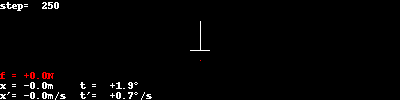
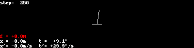
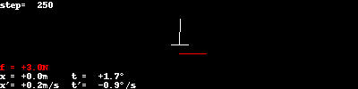
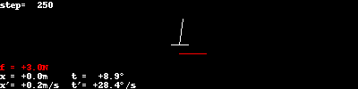
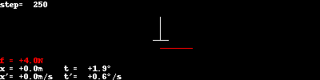
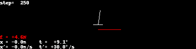
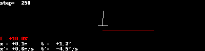
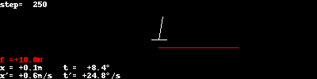

# Some Handcoded Policies for Balancing a Pole on a Cart

I show two examples:

1. Pole is slightly out of balance, but without any angular speed
2. Pole is slightly out of balance, with some angular speed

## Noop policy
Don't apply any force to the cart.

## Constant force policy
This policy applies a constant force to the cart.

## Random force policy
This policy applies a random force to the cart.

## Move opposite policy
This policy applies a force based on the pole's angle. If it's "on the
right", apply a force to the right, and vice versa.

## Move opposite (improved) policy
Similar to the previous one, but try to "swing the pole up" when it's in the
lower half.

