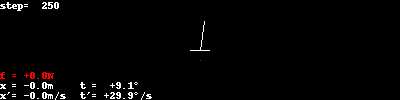

# RL for Balancing a Pole on a Cart

Physics simulation is based on
https://sharpneat.sourceforge.io/research/cart-pole/cart-pole-equations.html

If you do nothing, the pole just drops:




The goal is to apply some force to the cart to keep the pole upright. See
[here](HandcodedPolicies.md) for some handcoded policies.

## State Space
The state of the system is described by the following variables:
* $x$ - position of the cart
* $v$ - speed of the cart
* $\phi$ - angle of the pole
* $\dot\phi$ - speed of the angle of the pole

## Actions
The action space is simple: Either move left, or move right with a fixed force.

## Discrete Q Learning

The idea is to discretize the state space, and to then learn a table function
$Q(s,a$).

In the example below, I divide the state space into $180$ parts for the angle
$phi$. I ignore the other varibles. This means that the action to be taken
depends only on the current angle, and the algorithm cannot make a different
decision based on the cart position, speed, or angle speed of the pole.

Note: While the state space is discretized, the physics operate still on the
non-discrete state space.

When implementing an $\epsilon$-greedy policy, I first applied exploration on
the continuous state space. This meant that in a given state-space-cell, during
one episode, I would do random action for every time step. A key change that
made things work was to decide for a random action once the simulation enters a
state-space-cell, and to then keep that action constant until the simulation
enters a new state-space-cell.

```
python3 train.py \
  --num_episodes=10 \
  --max_episode_steps=1000 \
  --q_model_dim=180 \
  --rl_gamma=0.8 \
  --rl_alpha=0.8 \
  --rl_explore_prob_init=1.0 \
  --rl_explore_prob_decay=0.6 
```

* Reward: $1.0 \text{ if } \theta < 10°, 0.0 \text{ otherwise }$
* Run $10$ episodes per iteration
* Run a maximum of $1000$ steps per episode
* Stop when reward is $0$.
* Perform a random action with probability $p$, start with $p=1.0$
* After every iteration, lower the probability of a random action by a factor of $0.6$
* Use $\gamma=0.8$ for discounting future rewards
* Use $\alpha=0.8$, i.e. update $Q(s,a) \rightarrow (1-\alpha) Q_{old}(s,a) + \alpha Q_{new}(s,a)$


### Iteration 0 ($p=1.00$, $\gamma=0.8$)


Average steps in 10 episodes: 160.7 

### Iteration 1 ($p=0.50$, $\gamma=0.8$)


Average steps in 10 episodes: 217.7 

### Iteration 2 ($p=0.25$, $\gamma=0.8$)


Average steps in 10 episodes: 225.6 

### Iteration 3 ($p=0.13$, $\gamma=0.8$)


Average steps in 10 episodes: 652.3 

### Iteration 4 ($p=0.06$, $\gamma=0.8$)


Average steps in 10 episodes: 632.7 

### Iteration 5 ($p=0.03$, $\gamma=0.8$)


Average steps in 10 episodes: 1000.1 

### Iteration 6 ($p=0.02$, $\gamma=0.8$)


Average steps in 10 episodes: 1000.1 


## Implementation Details

General theory - see [notes](./MarkovDecisionProcess.md).

UNDER CONSTRUCTION

The current implementation is quite convoluted: I started trying to implement a
neural Q function - but then changed things to learn a Q table. The current
implementation has a quite arbitrary definition on when the agent can change
the action (see below). This should be changed. Also, I'm quite sure things
would be a lot faster if the Q table gets updated while the episodes are
running - instead of first collecting all the data from the episodes, and to
then update the Q table. This comes from the fact that the implementation is
compatible with learning a neural Q function (which needs all training examples
first).

### Replay Buffer

I implement a simple cache of past episodes. Each episode generates a list of
states, eventually ending after MAX_ITERATIONS or when the reward is 0.

This list of states (and actions) is added to a replay buffer. Before a new
episode is run, the old replay buffer is shuffled and trimmed to
REPLAY_CACHE_MAX_KEEP. Then, the new states are added (from the current
episode). Then the new buffer is shuffled again and trimmed to
REPLAY_CACHE_MAX_TOTAL.

This is to ensure the number of training examples cannot explore, while still
keeping past experiences/episodes available.

### Reward

#### First Try: $r=\cos(\theta)$
I first started of with using $cos(\theta)$ as the immediate reward. I first
started off with Deep-Q Learning (see below) - for which this reward did not
work well (I set $\gamma=0$): In order to pick the right action, the prediction
of the $cos(\theta)$ need to be extremely accurate. I was able to get the model
to predict this reward accurately enough, but it needed a lot of training
interations and some other tricks (predicting only the delta to the current
states angle theta).

#### Second Try: $r=+1$ if upright, $r=0$ otherwise
I then switched to this simpler reward. This is conceptually simpler and worked
well for the discrete q learning (still need to make it work for deep q
learning).


### Deep-Q Learning

Here, the state-space is not discretized and a neural network is learned that
directly takes the state variables as input and predicts the Q values.

I got something working - but the current state of the code is broken. Some
problems I ran into along the way:

* I first tried to train a model $Q(s, a)$, i.e. the action is an
  input to the network. However, this didn't work well.
* Only then I moved to training models $Q_a(s)$ - so essentially 1 NN
  per possible action.
