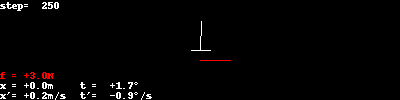
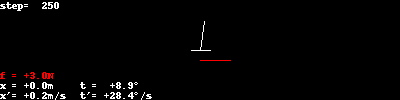
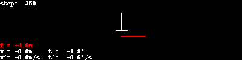

# Cart Pole Physics

Based on https://sharpneat.sourceforge.io/research/cart-pole/cart-pole-equations.html

## Trajectories for simple controllers
I show two examples:

1. Pole is slightly out of balance, but without any angular speed
2. Pole is slightly out of balance, with some angular speed

### Noop controller
This controller does nothing: the force on the cart is always 0.

### Constant force controller
This controller applies a constant force to the cart.

### Random force controller
This controller applies a random force to the cart.

### Move opposite force controller
This controller applies a force based on the pole's angle. If it's "on the
right", apply a force to the right, and vice versa.

### Move opposite force (improved) controller
Similar to the previous one, but try to "swing the pole up" when it's in the
lower half.

## Recap: Markov Decision Process

Based on https://www.cs.cmu.edu/~mgormley/courses/10601-s17/slides/lecture26-ri.pdf

### Definitions

Markov Decision Process = RL Framework + Markov Assumption

* States $S$, sequence $s_0^T = (s_0, s_1, ..., s_T)$
* Actions $A$, sequence $a_0^T = (a_0, a_1, ..., a_T)$
* Markov assumption: $p(s_{t+1}|s_0^t, a_0^t) = p(s_{t+1}|s_t,a_t)$
* Reward assumption: $r(s_0^{t+1}, a_0^t) = r(s_t, a_t, s_{t+1}) = r_{t+1}$
* Policy: $\pi(s_t|a_t) = p(a_t|s_t)$

Goal: Find the optimal policy
$$
\tilde \pi = \arg\max\limits_{\pi} \sum_{t=0}^{\infty} \gamma^t r_t
$$

Discount rate $\gamma$ is introduced to make the reward finite.

The value function computes the expected discouted rewards of state $s$ when
following policy $\pi$. It can be rewritten by taking into account the Markov
assumption:

$$
\begin{eqnarray}
V^\pi(s) &=& \sum\limits_{a_0^T,s_0^T|s_0=s} p(s_0^T, a_0^T) \sum\limits_{t=0}^{\infty} \gamma^t r(s_t, a_t, s_{t+1})\\
         &=& \sum\limits_{a} \pi(a|s) \sum\limits_{s'} p(s'|s,a) [ r(s,a,s') + \gamma V^{\pi}(s')]
\end{eqnarray}
$$

A similar calculation can be done for the Action-Value Function $Q^\pi(s,a)$,
which computes the expected discounted rewards following policy $\pi$ after
taking action $a$ from state $s$:

$$
\begin{eqnarray}
Q^\pi(s,a) &=& \sum\limits_{\stackrel{s_0^T}{s_0=s}}  \sum\limits_{\stackrel{a_0^T}{a_0=a}} p(s_0^T, a_0^T) \sum\limits_{t=0}^{\infty} \gamma^t r(s_t, a_t, s_{t+1})\\
           &=& \sum\limits_{a} \pi(a|s) \sum\limits_{s'} p(s'|s,a) [ r(s,a,s') + \gamma \sum\limits_{a'} \pi(a'|s') Q^{\pi}(s',a')]
\end{eqnarray}
$$

### Relationships between $Q$ and $V$
The following relationships hold:
$$
\begin{eqnarray}
V^{\pi}(s) &=& \sum\limits_{a} \pi(a|s) Q^{\pi}(s,a)\\
Q^{\pi}(s,a) &=& \sum\limits_{s'} p(s'|s,a) \left[ r(s,a,s') + \gamma V^{\pi}(s') \right]
\end{eqnarray}
$$

Optimal action-value function:
$$
Q^{*}(s,a) = \max\limits_{\pi} Q^{\pi}(s,a)
$$

Bellman optimality equation for $Q^*$:

$$
Q^{*}(s,a) = \sum\limits_{s'} p(s'|s,a) \left[ r(s,a,s') + \gamma \max\limits_{a'} Q^{*}(s',a')\right]
$$

TODO: If we have $Q^{*}$, then we can get the optimal policy by using a greedy algorithm ?

### Typical RL Tasks

#### Task: Given a policy $\pi$ what is $V^{\pi}(s)$ and $Q^{\pi}(s,a)$
This can be done by iteratively applying
$$
V^{k+1}(s) = \sum\limits_{a} \pi(a|s) \sum\limits_{s'} p(s'|s,a) [ r(s,a,s') + \gamma V^{k}(s')].
$$

We can start with $V^k(s)$ being arbitrary.

#### Task: Find an improved policy $\pi' > \pi$ such that $V^{\pi'}(s) > V^{\pi}(s) \forall s$
Choose new $\tilde\pi(s) = \arg\max\limits_{a} \sum\limits_{s'} p(s'|s,a) [ r(s,a,s') + \gamma V^{\pi}(s') ]$

(Is that correct??)

#### Task: Find the optimal policy

When we know the models $p(s,a,s')$ and $r(s,a,s')$:

3 Steps:
1. Inititalize some $\pi(s)$
2. Evaluate Policy, i.e. compute $V^{\pi}(s)$
3. Optimize policy: for all states, choose new $\tilde\pi(s) = \arg\max\limits_{a} \sum\limits_{s'} p(s'|s,a) [ r(s,a,s') + \gamma V^{\pi}(s') ]$

### TODO: Monte Carlo Methods, Model-Free Methods
