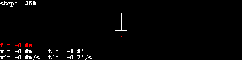

# Cart Pole Physics

Based on https://sharpneat.sourceforge.io/research/cart-pole/cart-pole-equations.html

## Trajectories for simple controllers
I show two examples:

1. Pole is slightly out of balance, but without any angular speed
2. Pole is slightly out of balance, with some angular speed

### Noop controller
This controller does nothing: the force on the cart is always 0.

### Constant force controller
This controller applies a constant force to the cart.

### Random force controller
This controller applies a random force to the cart.

### Move opposite force controller
This controller applies a force based on the pole's angle. If it's "on the
right", apply a force to the right, and vice versa.

### Move opposite force (improved) controller
Similar to the previous one, but try to "swing the pole up" when it's in the
lower half.

