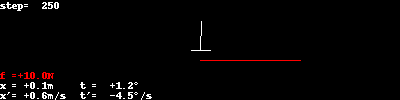

# Cart Pole Physics

Based on https://sharpneat.sourceforge.io/research/cart-pole/cart-pole-equations.html

## Trajectories for simple controllers
I show two examples:

1. Pole is slightly out of balance, but without any angular speed
2. Pole is slightly out of balance, with some angular speed

### Noop controller
This controller does nothing: the force on the cart is always 0.

### Constant force controller
This controller applies a constant force to the cart.

### Random force controller
This controller applies a random force to the cart.

### Move opposite force controller
This controller applies a force based on the pole's angle. If it's "on the
right", apply a force to the right, and vice versa.

### Move opposite force (improved) controller
Similar to the previous one, but try to "swing the pole up" when it's in the
lower half.

## Recap: Markov Decision Process

Based on https://www.cs.cmu.edu/~mgormley/courses/10601-s17/slides/lecture26-ri.pdf

Markov Decision Process = RL Framework + Markov Assumption

* States $S$, sequence $s_0^T = (s_0, s_1, ..., s_T)$
* Actions $A$, sequence $a_0^T = (a_0, a_1, ..., a_T)$
* Markov assumption: $p(s_{t+1}|s_0^t, a_0^t) = p(s_{t+1}|s_t,a_t)$
* Reward assumption: $r(s_0^{t+1}, a_0^t) = r(s_t, a_t, s_{t+1}) = r_{t+1}$
* Policy: $\pi(s_t,a_t) = p(a_t|s_t)$

Goal: Find the optimal policy
$$
\tilde \pi = \arg\max\limits_{\pi} \sum_{t=0}^{\infty} \gamma^t r_t
$$

Discount rate $\gamma$ is introduced to make the reward finite.

TODO:
* Value function $V^\pi(s)$
* Bellman Equation
* Action-Value Function $Q^\pi(s,a)$

